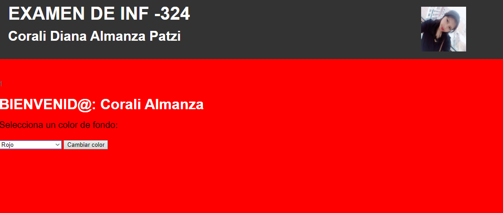
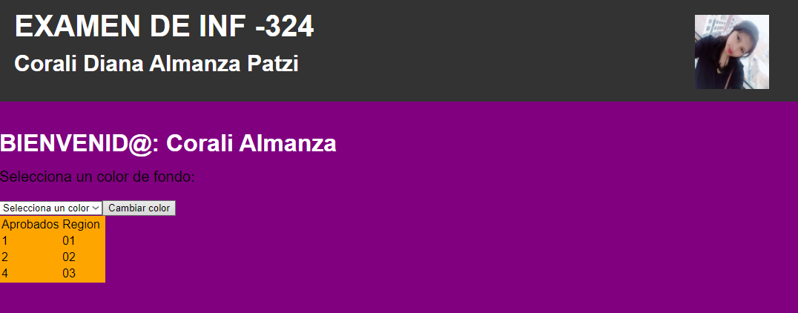

# Parcial1_PM
1.    Usted ha definido una tabla IDENTIFICADOR en la base de datos ACADEMICO, la cual contiene información de CI, Nombre completo, fecha de nacimiento, lugar de residencia (codigo) (El dato suyo es inicial, aunque el numero de carnet de sus amigos sean menores); otra tabla denominada USUARIO con los datos de CI y clave; realice lo siguiente: Genere un login por cada CI, ingresando a una pantalla de bienvenida (cuya cabecera indicara el nombre de su pagina, con una foto de usted con CSS) y un color por defecto (PHP), incluya select que tenga al menos tres colores.

Iniciar Sesion: 
Carnet de Identidad: 11071219
Contraseña: corali

2.    Con la Base de datos anterior, adicione una tabla de notas por materia y cuente la cantidad de aprobados por departamento de manera que solo obtenga una sola fila de resultados (con codigo PHP, con codigo SQL)

